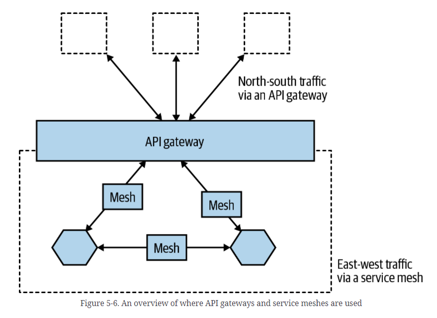

# POC: Proposition d'évolution de l'architecture des microservices Calf Middleware

## Introduction

Ce travail vise à démontrer les gains et la nécessité de faire évoluer l'architecture des 
microservices de CiT. 
  
L'architecture actuelle a été bien construite et répond assez aux besoins actuels de l'entreprise. 
Cependant, naturellement, les logiciels se dégradent avec le temps. Ajoute des éléments à la dette technique, 
de nouvelles dépendances sont ajoutées, des technologies deviennent obsolètes, etc. 

En outre, la technologie des microservices a beaucoup avancé ces dernières années, avec l'émergence et consolidation de 
nouvelles technologies (containers, kubernetes, <i>design patterns</i>, etc.), notamment à travers le framework 
Spring/Spring Cloud. 

Dans le domaine des tests d'intégration de microservices, par exemple, nous pouvons utiliser des 
tests conteneurisés. Lorsque ces tests démarrent des conteneurs avec les contextes de microservices, 
exécutent les tests, puis détruisent les conteneurs. 

Plus loin dans ce document, nous détaillons certains des bénéfices attendus avec l'évolution de
cette architecture.

Cependant, pour bien utiliser le framework Spring/Spring Cloud et plusieurs autres solutions 
adjacentes, nous devons mettre à jour des bibliothèques assez obsolètes. On utilise Spring Boot 1.4, lancé en 2016,
étant que nous sommes dans la version 2.6. Et comme déjà vérifié dans un de nos travaux récents sur le CiT, l'effort d'un 
refactoring pour l'évolution de l'architecture est plus petit et plus efficace qu'un éventuel effort de mise à jour 
des bibliothèques.

## Méthodologie proposée

Nous proposons de travailler sur l'évolution de l'architecture chaque fois que nous n'avons pas d'autres activités plus 
prioritaires à développer.

Profitant de la nature des microservices, nous pouvons travailler de manière évolutive et isolée, c'est-à-dire que 
chacun des microservices évolue séparément.

De cette façon, nous définirions d'abord une architecture standard, modèle, idéale pour nos microservices.
L'idée est d'implémenter une POC pour cela, en écrivant un petit nouveau projet qui sert de base et de modèle à 
l'architecture de nos microservices.

Ensuite, nous choisirons l'un des microservices (ou deux, étant donné que l'équipe middleware est composée de deux 
développeurs) et appliquerons la nouvelle architecture à ce microservice. Veuillez noter que jusqu'à ce que le nouveau 
microservice soit entièrement développé et testé, le microservice actuel sera opérationnel normalement.

Récapitulant :

1. Définir l'architecture par défaut (POC)
2. Choisir un ou deux microservices
3. Refactoriser le(s) microservice(s)
4. Testez (tests manuels et automatiques) le nouveau microservice
5. Remplacez le microservice actuel par le nouveau microservice
6. Choisissez un nouveau microservice et recommencez le processus

## Microservices

Principaux avantages des microservices:

- **Développement plus rapide**, permettant des **déploiements continus**
- **Plus facile à mettre à l'échelle**, manuellement ou automatiquement

Défis avec les microservices:

- Les composants qui utilisent la communication synchrone peuvent provoquer une **chaîne de problèmes de 
défaillance**, en particulier sous une charge élevée. 
- Maintenir **la configuration** à jour pour des composants.
- Il est difficile de **suivre une demande** en cours de traitement et impliquant de nombreux composants, par exemple, 
lors de l'exécution d'une analyse des causes, où chaque composant stocke les *logs* localement.
- **La configuration et la gestion manuelles** de nombreux composants peuvent devenir coûteuses et sujettes aux erreurs.

Plus nous avons de composants et plus ils sont petits, plus ces défis sont importants.

### Design Patterns (DPs) pour les microservices

Cette liste n'est pas destinée à être exhaustive; au lieu de cela, il s'agit d'une liste minimale de modèles de 
conception nécessaires pour gérer les défis que nous avons décrits précédemment.

La proposition est d'utiliser des versions récentes d'outils tels que Spring Boot, Spring Cloud et Kubernetes, pour 
implémenter ces *Design Patterns*.

#### Service discovery

<table>
  <tr>
    <th>Le problème</th>
    <td>Comment les clients peuvent-ils trouver des microservices et leurs instances?</td>
  </tr>
  <tr>
    <th>La solution</th>
    <td>Ajoutez un nouveau composant - un <i>service discovery</i> - qui assure le suivi 
        des microservices actuellement disponibles et des adresses IP de ses instances.</td>
  </tr>
<tr>
    <th>Exigences de la solution</th>
    <td>
      <ul>
        <li>Enregistrez/désenregistrez automatiquement les microservices et leurs instances au fur et à mesure qu'ils 
            vont et viennent</li>
        <li>Le client doit être en mesure de faire une demande à un <i>endpoint</i> logique pour le microservice. 
            La demande sera routé vers l'une des instances de microservice disponibles.</li>
        <li>Les requêtes adressées à un microservice doivent être équilibrées (<i>load balanced</i>) sur les instances 
            disponibles.</li>
        <li>Nous devons être en mesure de détecter les instances qui ne sont actuellement pas saines, afin que les 
            demandes ne leur soient pas routé.</li>
      </ul>
    </td>
</tr>
<tr>
  <th>Notes d'implémentation</th>
  <td> Ce DP peut être implémenté (avec outils comme Netflix Eureka et Kubernetes) en utilisant deux stratégies 
      différentes
    <ul>
      <li><b>Routage côté client:</b> le client utilise une bibliothèque qui communique avec le service de découverte 
          de service pour trouver les instances appropriées auxquelles envoyer les demandes.</li>
      <li><b>Server-side routing:</b> L'infrastructure du service de découverte de service expose également un proxy 
            inverse qui toutes les demandes sont envoyées à. Le proxy inverse transmet les requêtes à une instance de 
            microservice appropriée sur nom du client.</li>
    </ul>
  </td>
</tr>
</table>

#### Serveur Edge

<table>
  <tr>
    <th>Le problème</th>
    <td>Dans un système de microservices, il est souvent souhaitable d'exposer certains des microservices à 
      l'extérieur et de masquer les microservices restants de l'accès externe. Les microservices exposés doivent 
      être protégés contre les requêtes de clients malveillants.</td>
  </tr>
  <tr>
    <th>La solution</th>
    <td>Ajoutez un nouveau composant, un serveur Edge, au système par lequel toutes les requêtes entrantes 
        passeront</td>
  </tr>
<tr>
    <th>Exigences de la solution</th>
    <td>
      <ul>
        <li>Masquer les services internes qui ne doivent pas être exposés hors de leur contexte; c'est-à-dire, 
            router uniquement les requêtes vers des microservices configurés pour autoriser les requêtes externes</li>
        <li><i>Nota: normalement, nous avons une autre exigence qui serait exposez les services externes et protégez-les 
            des requêtes malveillantes; c'est-à-dire, utilisez des protocoles standard et les meilleures pratiques 
            telles que OAuth, OIDC, les jetons JWT et les clés API pour vous assurer que les clients sont dignes de 
            confiance.   Cependant, bien que nous démontrions dans le POC comment le mettre en œuvre, nous ne 
            considérerons pas cette exigence pour le CiT, car nous ne le jugeons pas nécessaire</i></li>
      </ul>
    </td>
</tr>
<tr>
  <th>Notes d'implémentation</th>
  <td> Un serveur Edge se comporte généralement comme un proxy inverse et peut être intégré à un service de 
      découverte pour fournir des <i>dynamic load balacing</i>.</td>
</tr>

</table>

#### Microservices reactive

<table>
  <tr>
    <th>Le problème</th>
    <td>Traditionnellement, en tant que développeurs Java, nous sommes habitués à implémenter une communication 
        synchrone à l'aide d'E/S bloquantes, par exemple, l'API RESTful JSON sur HTTP. L'utilisation d'E/S bloquantes 
        signifie qu'un thread est alloué à partir du système opérationnel pour la durée de la requête. 
        Si le nombre de requêtes simultanées augmente, un serveur peut manquer de threads disponibles dans le système 
        d'exploitation, ce qui entraîne des problèmes allant de temps de réponse plus longs à des pannes de 
        serveurs. L'utilisation de l'architecture de microservices aggrave généralement ce problème, où la chaîne de 
        microservices coopérants est généralement utilisée pour répondre à la demande. 
        Plus il y a de microservices impliqués dans le traitement d'une requête, plus les threads disponibles seront 
        drainés rapidement.</td>
  </tr>
  <tr>
    <th>La solution</th>
    <td>Utilisez des E/S non bloquantes pour vous assurer qu'aucun thread n'est alloué en attendant que le traitement 
        se produise dans un autre service, c'est-à-dire une base de données ou un autre microservice.</td>
  </tr>
<tr>
    <th>Exigences de la solution</th>
    <td>
      <ul>
        <li>Dans la mesure du possible, utilisez un modèle de programmation asynchrone, en envoyant des messages sans 
            attendre que le destinataire les traite</li>
        <li>Si un modèle de programmation synchrone est préféré, utilisez des infrastructures réactives capables 
            d'exécuter des requêtes synchrones à l'aide d'E/S non bloquantes, sans allouer de thread en attendant 
            une réponse. Cela facilitera la mise à l'échelle des microservices afin de gérer une charge de travail 
            accrue (<i>increased workload</i>).</li>
        <li>Les microservices doivent également être conçus (<i>designed</i>) pour être résilients et auto-réparateurs. 
          <ul>
            <li>Résilient c'est-à-dire capable de produire une réponse même si l'un des services dont il dépend tombe en panne</li>
            <li>auto-guérison, ce qui signifie qu'une fois que le service défaillant est à nouveau opérationnel, 
            le microservice doit pouvoir recommencer à l'utiliser.</li>
          </ul> 
        </li>
      </ul>
    </td>
</tr>
<tr>
  <th>Notes d'implémentation</th>
  <td> Un serveur Edge se comporte généralement comme un proxy inverse et peut être intégré à un service de 
      découverte pour fournir des <i>dynamic load balacing</i>.
  </td>
</tr>

</table>

#### Configuration centrale

<table>
  <tr>
    <th>Le problème</th>
    <td><ul>
          <li>Comment puis-je obtenir la configuration complète pour toutes les instances de microservice en 
              cours d'exécution?</li>
          <li>Comment mettre à jour la configuration et m'assurer que toutes les instances de microservice 
              concernées sont correctement mises à jour?</li>
        </ul>
    </td>
  </tr>
  <tr>
    <th>La solution</th>
    <td>Ajouter un nouveau composant, un serveur de configuration, pour stocker la configuration de tous les 
        microservices</td>
  </tr>
<tr>
    <th>Exigences de la solution</th>
    <td>Rendre possible le stockage des informations de configuration pour un groupe de microservices en un seul 
        endroit, avec différents paramètres pour différents environnements (par exemple, dev, test, qa et prod)
    </td>
</tr>
<tr>
  <th>Notes d'implémentation</th>
  <td> </td>
</tr>

</table>

#### <i>Distributed tracing</i>

<table>
  <tr>
    <th>Le problème</th>
    <td>Il doit être possible de suivre les requêtes et les messages qui 
        circulent entre les microservices lors du traitement d'une requête
        externe vers le système.
    </td>
  </tr>
  <tr>
    <th>La solution</th>
    <td> Pour suivre le traitement entre les microservices coopérants, nous 
        devons nous assurer que toutes les demandes et tous les messages associés 
        sont marqués avec un ID de corrélation commun et que l'ID de corrélation 
        fait partie de tous les événements du <i>log</i>.
        Sur la base d'un ID de corrélation, nous pouvons utiliser le service de 
        <i>log</i> centralisé (DP déjà implémenté dans CiT avec Kibana) pour 
        rechercher tous les événements du <i>log</i> associés. 
          Pour pouvoir analyser les retards dans une chaîne d'appels de microservices 
        coopérants, nous devons être en mesure de collecter des horodatages pour 
        le moment où les demandes, les réponses et les messages entrent et sortent 
        de chaque microservice.</td>
  </tr>
<tr>
    <th>Exigences de la solution</th>
    <td>
      <ul>
        <li>Attribuez des ID de corrélation uniques à toutes les demandes et 
            événements entrants ou nouveaux</li>
        <li>Lorsqu'un microservice effectue une requête sortante ou envoie un 
            message, il doit ajouter l'ID de corrélation à la requête et au 
            message</li>
        <li>Tous les événements du <i>log</i> doivent inclure l'ID de corrélation 
            dans un format prédéfini afin que le service du <i>log</i> 
            centralisé puisse extraire l'ID de corrélation de l'événement de 
            journal et le rendre consultable</li>
        <li>Des <i>trace records</i> doivent être créés lorsque les demandes, 
            les réponses et les messages entrent ou sortent d'une instance de 
            microservice</li>
      </ul>
    </td>
</tr>
<tr>
  <th>Notes d'implémentation</th>
  <td> - </td>
</tr>
</table>

#### <i>Circuit breaker</i>

<table>
  <tr>
    <th>Le problème</th>
    <td>Un système de microservices qui utilise l'intercommunication 
        synchrone peut être exposé à une chaîne de défaillances. Si un 
        microservice cesse de répondre, ses clients peuvent également 
        rencontrer des problèmes et cesser de répondre aux demandes de leurs 
        clients. Le problème peut se propager de manière récursive dans un 
        système et en supprimer des parties importantes.  
        Ceci est particulièrement courant dans les cas où les requêtes synchrones 
        sont exécutées à l'aide d'E/S bloquantes, c'est-à-dire en bloquant un 
        thread du system opérationnel sous-jacent pendant le traitement d'une 
        requête.
    </td>
  </tr>
  <tr>
    <th>La solution</th>
    <td>Ajouter un <i>circuit breaker</i> qui empêche les nouvelles requêtes 
        sortantes d'un appelant s'il détecte un problème avec le service qu'il 
        appelle</td>
  </tr>
<tr>
    <th>Exigences de la solution</th>
    <td>
      <ul>
        <li><b>Ouvrez</b> le circuit et échouez rapidement (sans attendre un délai 
            d'attente) si des problèmes avec le service sont détectés.</li>
        <li>Sonde de correction de panne (également connue sous le nom de <b>circuit 
            semi-ouvert</b>); c'est-à-dire, permettre à une seule requête de passer 
            régulièrement pour voir si le service fonctionne à nouveau normalement.</li>
        <li><b>Fermez</b> le circuit si la sonde détecte que le service fonctionne à 
            nouveau normalement.</li>
      </ul>
    </td>
</tr>
<tr>
  <th>Notes d'implémentation</th>
  <td> - </td>
</tr>
</table>

Certains autres DPs sont déjà mis en œuvre par CiT, tels que :
- <i>Centralized log analysis</i>, avec Kibana.
- <i>Control loop</i> (<i>Observe, Analyse, Act</i>), avec kubernetes.
- <i>Centralized monitoring and alarms</i>, avec Grafana

### *Service Meshes* et *API Gateways*

D'une manière générale, un *API Gateway* se trouve sur le périmètre de votre système et traite le trafic nord-sud. 
Ses principales préoccupations sont la gestion de l'accès du monde extérieur à vos microservices internes. 
Un *service meshe*, en revanche, traite la communication entre les microservices à l'intérieur 
de votre périmètre (le trafic est-ouest), comme le montre la figure ci-dessous.

Les *services mesh* et les *API Gateway* peuvent potentiellement permettre aux microservices de partager 
du code sans nécessiter la création de nouvelles bibliothèques clientes ou de nouveaux microservices. 
En termes (très) simples, ils peuvent fonctionner comme des proxys entre les microservices. 

Si on utilise un *service mesh* ou *API Gateway* pour implémenter un comportement partagé et 
commun pour vos microservices, il est essentiel que ce comportement soit totalement générique, c'est-à-dire que 
le comportement dans le proxy n'ait aucun rapport avec un comportement spécifique d'un microservice.

### Spring Boot et containers

On propose développer des microservices contenant une logique métier basée sur des Spring Beans simples et exposer 
des API REST à l'aide de Spring WebFlux. Les API seront documentées sur la base de la spécification OpenAPI à l'aide 
de springdoc-openapi. Pour rendre persistantes les données traitées par les microservices, nous utiliserons Spring 
Data Cassandra.

Depuis la sortie de Spring Boot v2.0 en mars 2018, il est devenu beaucoup plus facile de développer des microservices 
réactifs, y compris des API REST synchrones non bloquantes. Pour développer des services asynchrones basés sur des 
messages, nous utiliserons Spring Cloud Stream.

Et pour la conteneurisation, nous continuerons avec les solutions Docker et Kubernetes.

### Multi-project

Pour ce POC nous utiliserons l'approche multi-project juste pour faciliter le démarrage de tous les microservices à 
partir de zéro.

D'un point de vue DevOps, une configuration multi-projets n'est pas à privilégier. Au lieu de cela, 
pour permettre à chaque microservice d'avoir son propre cycle de construction et de publication, il serait 
préférable de configurer un pipeline de construction distinct pour chaque projet de microservice.

## Références

1. Building Microservices - Second edition. Sam Newman. O'Reilly Media, Inc., 2021.
2. Microservices with Spring Boot and Spring Cloud - Second Edition. Magnus Larsson. Packt Publishing, 2021.
3. The Reactive manifesto. https://www.reactivemanifesto.org/ 
4. Good design principles for microservices, the 12-factor app. https://12factor.net 