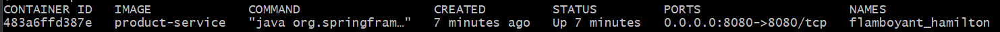

# Deploying using Docker

On this branch, we will have run fully automated tests of our microservice 
landscape that start all our microservices as Docker containers, requiring 
no infrastructure other than a Docker engine. We will have also run a number 
of tests to verify that the microservices work together as expected, and 
finally shut down all the microservices, leaving no traces of the tests we 
executed.

The source code in the microservices will not be affected by running the 
microservices in containers, only their configuration.

When running in Docker, we can use the default port 8080 for all our 
microservices without any risk of port conflicts. On the other hand, 
if we need to talk to the other microservices, we can no longer use 
localhost like we could when we ran them on the same host.

To handle the different configurations that are required when running 
locally without Docker and when running the microservices as Docker 
containers, we will use Spring profiles.
We will create a new Spring profile named docker to be used when we 
run our microservices as containers in Docker.

## Dockerfile

The fat-jar file takes time to unpackage when the Docker container starts up. 
A better approach is to instead unpackage the fat-jar when the Docker image 
is built.
The fat-jar file is very big, some 20 MB. If we want to make repeatable 
changes to the application code in the Docker images during development, 
this will result in suboptimal usage of the Docker build command. Since Docker 
images are built in layers, we will get one very big layer that needs to be 
replaced each time, even in the case where only a single Java class is changed
in the application code.

A better approach is to divide the content into different layers, where 
files that do not change so frequently are added in the first layer and 
files that change the most are placed in the last layer. This will result in 
good use of Docker's caching mechanism for layers. For the first stable layers 
that are not changed when some application code is changed, Docker will simply 
use the cache instead of rebuilding them. This will result in faster builds 
of the microservices' Docker images.

We use a base image for the Java SE 16 JRE, Java Runtime Environment, that 
only contains programs and libraries required to run a Java program. 
Unfortunately, the OpenJDK project does not provide a Docker image for Java 
SE 16 JRE.
There are other open source projects that package the OpenJDK binaries into 
Docker images. One of the most widely used projects is AdoptOpenJDK.
AdoptOpenJDK provides both full JDK editions and minimized JRE editions of 
their Docker images.

When it comes to handling the suboptimal packaging of fat-jar files in Docker 
images, Spring Boot addressed this issue in v2.3.0, making it possible to 
extract the content of a fat-jar file into a number of folders. By default, 
Spring Boot creates the following folders after extracting a fat-jar file:

1. Dependencies, containing all dependencies as jar-files
2. spring-boot-loader, containing Spring Boot classes that know how to start 
a Spring Boot application
3. snapshot-dependencies, containing snapshot dependencies, if any
4. application, containing application class files and resources

*The Spring Boot documentation recommends creating one Docker layer for each 
folder in the order listed above.*

To handle the extraction of the fat-jar file in the Dockerfile we use a 
multi-stage build, meaning that there is a first step, named builder, that 
handles the extraction. The second stage builds the actual Docker image that 
will be used at runtime, picking the files as required from the first stage. 
Using this technique, we can handle all packaging logic in the Dockerfile but 
at the same time keep the size of the final Docker image to a minimum.

### Running one microservice

Considering ```product-service```, for example:

```
docker build -t product-service .
docker run --rm -p8080:8080 -e "SPRING_PROFILES_ACTIVE=docker" product-service
```

Try to execute:

```curl localhost:8080/product/3```

See the ```service address```: <container_id>/<ip_alocated_in_container>:<port>.

Example:
productId":3,"name":"name-3","weight":123,"serviceAddress":"483a6ffd387e/172.17.0.2:8080"}

Check with: ```docker ps```

Example: 


As we can see from the preceding output, the hostname is equivalent to the ID of the container, 
which is good to know if you want to understand which container actually responded to your request.

### Docker compose

We configured the application.yml file for product-composite-service for the product-composite-service
since it needs to know where to find the core services. 
When we ran all the services on localhost, it was configured to use localhost and individual port 
numbers, 7001-7003, for each core service. When running in Docker, each service will have its 
own hostname but will be accessible on the same port number, 8080

See that the hostnames ```product```, ```recommendation``` and ```review``` used in this ```application.yml``` 
file from the 
```docker-compose.yml``` file.

For the product-composite service, we will also specify port 
mappings – we will expose its port so it can be reached from outside 
Docker. The other microservices will not be accessible from the outside.

#### Running with Docker Compose

```
mvn clean install
docker-compose build
docker-compose up -d
```

We can follow the startup by monitoring the output that's written to each container log with the following command
```
docker-compose logs -f
```

Try :
```
curl localhost:8080/product-composite/123 -s | jq .
```

Stopping:
```
docker-compose down
```

#### Testing with the script

```
./z_test-em-all.bash start stop
```

## Docker tips

```
docker build -t product-service .
docker images | grep product-service
docker run -d -p8080:8080 -e "SPRING_PROFILES_ACTIVE=docker" --name my-prd-srv product-service
docker logs my-prd-srv -f
docker rm -f my-prd-srv

docker run --rm -p8080:8080 -e "SPRING_PROFILES_ACTIVE=docker" product-service

docker-compose build
docker-compose up -d
docker-compose ps
docker-compose logs -f
docker-compose restart product
docker-compose up -d --scale product=1
docker-compose down

docker system prune -f --volumes
docker ps --format {{.Names}}
```