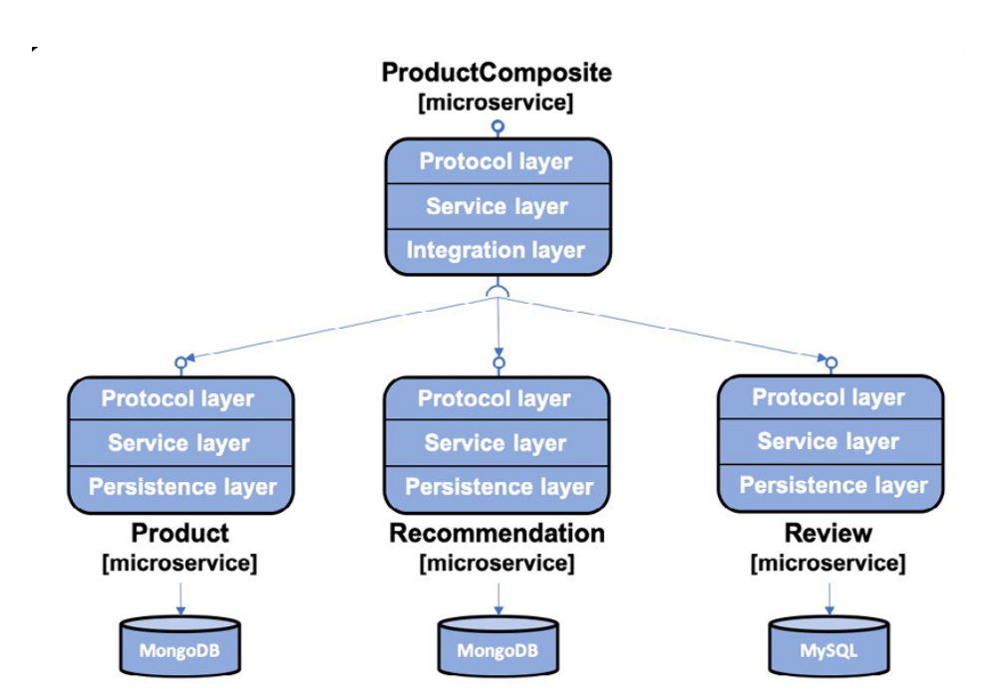

# Persistence and Testcontainers

We will use the Spring Data project to persist data to MongoDB and 
MySQL databases.
The product and recommendation microservices will use Spring Data for 
MongoDB and the review microservice will use Spring Data for the JPA
to access a MySQL database.

We will add operations to the RESTful APIs to be able to create and 
delete data in the databases. The existing APIs for reading data 
will be updated to access the databases. We will run the databases 
as Docker containers, managed by Docker Compose, that is, in the 
same way as we run our microservices.



The Protocol layer handles protocol-specific logic. It is very 
thin, only consisting of the RestController annotations in the api 
project and the common GlobalControllerExceptionHandler in the util 
project. The main functionality of each microservice resides in 
the Service layers. The product-composite service contains an 
Integration layer used to handle the communication with the three 
core microservices. The core microservices will all have a 
Persistence layer used for communicating with their databases.

## Adding a persistence layer to the core microservices

Besides using Spring Data, we will also use a Java bean mapping 
tool, MapStruct, that makes it easy to transform between Spring 
Data entity objects and the API model classes.

*If you are using IntelliJ IDEA, you also need to ensure that 
support for annotation processing is enabled. Open Preferences and 
navigate to Build, Execute, Deployment | Compiler | Annotations 
Processors. Verify that the checkbox named Enable annotation 
processing is selected*

### Entity classes

The ```id``` field is not exposed in the API, as a best practice from a 
security perspective.

The ```version``` field is used to implement optimistic locking, 
allowing Spring Data to verify that updates of an entity in the 
database do not overwrite a concurrent update. If the value of 
the version field stored in the database is higher than the value 
of the version field in an update request, it indicates that the 
update is performed on stale data—the information to be updated 
has been updated by someone else since it was read from the 
database. Attempts to perform updates based on stale data will 
be prevented by Spring Data.

### Logging the database connection URL

When scaling up the number of microservices where each microservice connects to 
its own database, it can be hard to keep track of what database each microservice 
actually uses. To avoid this confusion, a good practice is to add a log statement 
directly after the startup of a microservice that logs connection information that 
is used to connect to the database. This is done in each Application class. 
See ProductServiceApplication, for example.

### The MongoDB and MySQL CLI tools

```
docker-compose exec mongodb mongo ––quiet
docker-compose exec mysql mysql -uuser -p review-db
```

## Testing persistence with TestContainers

When writing persistence tests, we want to start a database when the tests begin and tear it down when the tests complete.
Spring Boot comes with two class-level annotations tailored for this specific requirement:
- @DataMongoTest: This annotation starts up a MongoDB database when the test starts.
- @DataJpaTest: This annotation starts up a SQL database when the test starts.
    - By default, Spring Boot configures the tests to roll back updates to the SQL database to minimize the risk of 
negative side effects on other tests. In our case, this behavior will cause some of the tests to fail. 
Therefore, automatic rollback is disabled with the class level annotation @Transactional(propagation = NOT_SUPPORTED).

To enable the use of MongoDB and MySQL when running automated integration tests, we will use Testcontainers and its 
support for JUnit 5, MongoDB, and MySQL.
Testcontainers (https://www.testcontainers.org) is a library that simplifies running automated integration tests by 
running resource managers like a database or a message broker as a Docker container. Testcontainers can be 
configured to automatically start up Docker containers when JUnit tests are started and tear down the containers 
when the tests are complete.

The @DataMongoTest and @DataJpaTest annotations are designed to start an embedded database by default. 
Since we want to use a containerized database, we have to disable this feature. 
- For the @DataJpaTest annotation, this can be done by using a @AutoConfigureTestDatabase annotation like this
- For the @DataMongoTest annotation, this can be done by using the excludeAutoConfiguration parameter and specifying 
that the class EmbeddedMongoAutoConfiguration will be excluded

By default, the log output from Testcontainers is rather extensive. A Logback configuration file is placed in the 
src/test/resource folder to limit the amount of log output.

## Useful commands

To access data stored in MongoDB
```
docker-compose exec mongodb mongo product-db --quiet --eval "db.products.find()"
```

To access data stored in MySQL
```
docker-compose exec mysql mysql -uuser -p review-db -e "select * from reviews"
```