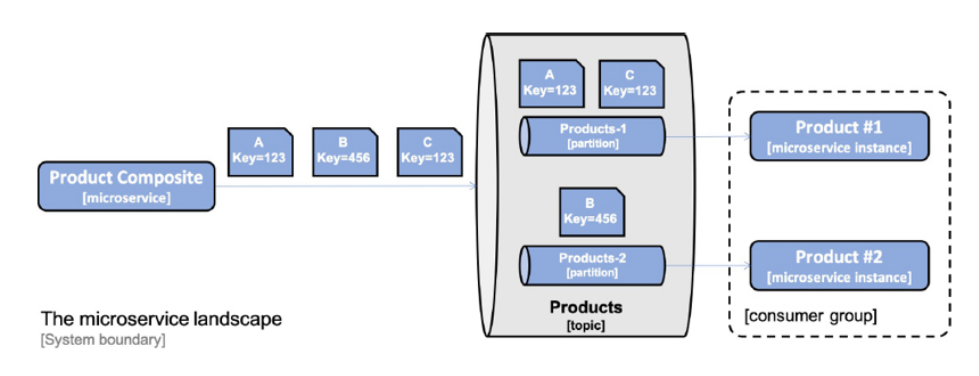

# Reactive microservices

Here, we will develop reactive microservices. The foundation for reactive systems is that they are 
message-driven — they use asynchronous communication.  This enables them to be elastic, in other words, 
scalable and resilient, meaning that they will be tolerant
of failures. Elasticity and resilience together will enable a reactive system to be responsive. , that is, non-blocking synchronous REST APIs and asynchronous 
event-driven services. 

Asynchronous message passing of events is preferable over synchronous APIs. 
This is because the microservice will only depend on access to the messaging system at runtime, instead of 
being dependent on synchronous access to a number of other microservices.

There are, however, a number of cases where synchronous APIs could be favorable. For example:
- For read operations where an end user is waiting for a response 
- Where the client platforms are more suitable for consuming synchronous APIs, for example, mobile apps or SPA web applications
- Where the clients will connect to the service from other organizations – where it might be hard to agree on a common messaging system to use across organizations

Here, we'll use the following:


- The create, read, and delete services exposed by the product composite microservice will be based on non-blocking 
synchronous APIs. The composite microservice is assumed to have clients on both web and mobile platforms, as well 
as clients coming from other organizations rather than the ones that operate the system landscape. Therefore, 
synchronous APIs seem like a natural match.
- The read services provided by the core microservices will also be developed as non-blocking synchronous APIs 
since there is an end user waiting for their responses.
- The create and delete services provided by the core microservices will be developed as event-driven asynchronous
services, meaning that they will listen for create and delete events on topics dedicated to each microservice.
- The synchronous APIs provided by the composite microservices to create and delete aggregated product information 
will publish create and delete events on these topics. If the publish operation succeeds, it will return with a 
202 (Accepted) response, otherwise an error response will be returned. The 202 response differs from a normal 
200 (OK) response – it indicates that the request has been accepted, but not fully processed. Instead, the 
processing will be completed asynchronously and independently of the 202 response.

## Project Reactor

The reactive support in Spring 5 is based on Project Reactor (https://projectreactor.io). Project Reactor is fundamental – it is what Spring 
WebFlux, Spring WebClient, and Spring Data rely on to provide their reactive and non-blocking features.

The programming model is based on processing streams of data, and the core data types in Project Reactor are Flux 
and Mono. A ```Flux``` object is used to process a stream of 0...n elements and a ```Mono``` object is used to process a 
stream that either is empty or returns at most one element.

## Non-blocking persistence using Spring Data for MongoDB

Making the MongoDB-based repositories (for ProductRepository and RecommendationRepository) for the product and recommendation services reactive is very simple:
- Change the base class for the repositories to ReactiveCrudRepository
- Change the custom finder methods to return either a Mono or a Flux object

Naturally we have to change the ```PersistenceTests``` class.

## Non-blocking REST APIs in the core services

With a non-blocking persistence layer in place, it's time to make the APIs in the core services non-blocking as well. We need to make the following changes:

- Change the APIs so that they only return reactive data types
- Change the service implementations so they don't contain any blocking code
- Change our tests so that they can test the reactive services
- Deal with blocking code – isolate the code that still needs to be blocking from the non-blocking code

For the dealing with blocking code, in the case of the review service, which uses JPA to access its data in a 
relational database, we don't have support for a non-blocking programming model. Instead, we can run the 
blocking code using a Scheduler, which is capable of running the blocking code on a thread from a dedicated thread 
pool with a limited number of threads. Using a thread pool for the blocking code avoids draining the available 
threads in the microservice and avoids affecting concurrent non-blocking processing in the microservice, if there 
is any. Let's see how this can be set up in the following steps:
1. First, we configure a scheduler bean and its thread pool in the main class ReviewServiceApplication
2. Next, we inject the scheduler named jdbcScheduler into the review service implementation class
3. Finally, we use the scheduler's thread pool in the reactive implementation of the getReviews() method

## Non-blocking REST APIs in the composite services

To make our REST API in the composite service non-blocking, we need to do the following:

- Change the API so that its operations only return reactive datatypes
- Change the service implementation so it calls the core services' APIs in parallel and in a non-blocking way
- Change the integration layer so it uses a non-blocking HTTP client
- Change our tests so that they can test the reactive service

### Changes in the API

To make the API of the composite service reactive, we need to apply the same type of change that we applied for 
the APIs of the core services we described previously. This means that the return type of the ```getProduct()``` method, 
```ProductAggregate```, needs to be replaced with ```Mono<ProductAggregate>```. The ```createProduct()``` and ```deleteProduct()``` 
methods need to be updated to return a ```Mono<Void>``` instead of a void, otherwise we can't propagate any error 
responses back to the callers of the API.

### Changes in the service implementation

To be able to call the three APIs in parallel, the service implementation uses the static ```zip()``` method on the ```Mono``` 
class. The ```zip``` method is capable of handling a number of parallel reactive requests and zipping them together once 
they all are complete.

Explaining:

- The first parameter of the zip method is a lambda function that will receive the responses in an array, named values. The array will contain a product, a list of recommendations, and a list of reviews. The actual aggregation of the responses from the three API calls is handled by the same helper method as before, createProductAggregate(), without any changes.
- The parameters after the lambda function are a list of the requests that the zip method will call in parallel, one Mono object per request. In our case, we send in three Mono objects that were created by the methods in the integration class, one for each request that is sent to each core microservice.

### Changes in the integration layer

In the ProductCompositeIntegration integration class, we have replaced the blocking HTTP client, RestTemplate, with 
a non-blocking HTTP client, WebClient, that comes with Spring 5.

### Changes in the test code

The only change that's required in the test classes is to update the setup of Mockito and its mock of the 
integration class. The mock needs to return Mono and Flux objects. The setup() method uses the helper methods 
Mono.just() and Flux.fromIterable()

## Developing event-driven asynchronous services

we will develop event-driven and asynchronous versions of the create and delete services. The composite service will publish create and delete events on each core service topic and then return an OK response back to the caller without waiting for processing to take place in the core services.

- Handling challenges with messaging
- Defining topics and events
- Consuming events in the core services
- Publishing events in the composite service

### Handling challenges with messaging

To implement the event-driven create and delete services, we use Spring Cloud Stream, where it is easy to publish and 
consume messages on a topic.

The programming model is based on a functional paradigm, where functions implementing one of the functional interfaces Supplier, Function, or Consumer in the package java.util.function can be chained together to perform decoupled event-based processing.

To trigger such functional-based processing externally, from non-functional code, the helper class StreamBridge can be used.
The helper class StreamBridge is used to trigger the processing. It will publish a message on a topic. 

A function that consumes events from a topic (not creating new events) can be defined by implementing the functional interface ```java.util.function.Consumer```.

This programming model can be used independently of the messaging system used, for example, RabbitMQ or Apache Kafka.

Some features in Spring Cloud Stream used:
- Consumer groups
- Retries and dead-letter queues
- Guaranteed orders and partitions

#### Consumer groups

The problem here is, if we scale up the number of instances of a message consumer, for example, if we start two instances of the product microservice, both instances of the product microservice will consume the same messages, as illustrated by the following diagram:


This could result in one message being processed two times, potentially leading to duplicates or other undesired inconsistencies in the database. Therefore, we only want one instance per consumer to process each message. This can be solved by introducing a consumer group, as illustrated by the following diagram:


In Spring Cloud Stream, a consumer group can be configured on the consumer side. For example, for the product microservice it will look like this:

```
spring.cloud.stream:
    bindings.messageProcessor-in-0:
        destination: products
        group: productsGroup
```

From this configuration, we can learn the following:

- Spring Cloud Stream applies, by default, a naming convention for binding a configuration to a function. For messages sent to a function, the binding name is ```<functionName>-in-<index>```:
    - ```functionName``` being the name of the function, ```messageProcessor``` in the preceding example.
    - ```index``` being set to ```0```, unless the function requires multiple input or output arguments. We will not use multi-argument functions, so ```index``` will always be set to 0 in our examples.
    - For outgoing messages, the binding name convention is ```<functionName>-out-<index>```.
- The ```destination``` property specifies the name of the topic that messages will be consumed from, ```products``` in this case.
- The ```group``` property specifies what consumer group to add instances of the product microservice to, ```productsGroup``` in this example. This means that messages sent to the ```products``` topic will only be delivered by Spring Cloud Stream to one of the instances of the ```product``` microservice.

#### Retries and dead-letter queues

If a consumer fails to process a message, it may be requeued for the failing consumer until it is successfully processed. If the content of the message is invalid, also known as a poisoned message, the message will block the consumer from processing other messages until it is manually removed. If the failure is due to a temporary problem, for example, the database can't be reached due to a temporary network error, the processing will probably succeed after a number of retries.

It must be possible to specify the number of retries until a message is moved to another storage for fault analysis and correction. A failing message is typically moved to a dedicated queue called a dead-letter queue. To avoid overloading the infrastructure during temporary failure, for example, a network error, it must be possible to configure how often retries are performed, preferably with an increasing length of time between each retry.

In Spring Cloud Stream, this can be configured on the consumer side, for example, for the ```product``` microservice, as shown here:

```
spring.cloud.stream.bindings.messageProcessor-in-0.consumer:
  maxAttempts: 3
  backOffInitialInterval: 500
  backOffMaxInterval: 1000
  backOffMultiplier: 2.0

spring.cloud.stream.rabbit.bindings.messageProcessor-in-0.consumer:
  autoBindDlq: true
  republishToDlq: true

spring.cloud.stream.kafka.bindings.messageProcessor-in-0.consumer:
  enableDlq: true
```

In the preceding example, we specify that Spring Cloud Stream should perform 3 retries before placing a message on the dead-letter queue. The first retry will be attempted after 500 ms and the two other attempts after 1000 ms.

Enabling the use of dead-letter queues is binding-specific; therefore, we have one configuration for RabbitMQ and one for Kafka.

#### Guaranteed order and partitions

If the business logic requires that messages are consumed and processed in the same order as they were sent, we cannot use multiple instances per consumer to increase processing performance; for example, we cannot use consumer groups. This might, in some cases, lead to an unacceptable latency in the processing of incoming messages.

We can use **partitions** to ensure that messages are delivered in the same order as they were sent but without losing performance and scalability.

In most cases, strict order in the processing of messages is only required for messages that affect the same business entities. For example, messages affecting the product with product ID 1 can, in many cases, be processed independently of messages that affect the product with product ID 2. This means that the order only needs to be guaranteed for messages that have the same product ID.

The solution to this is to make it possible to specify a **key** for each message, which the messaging system can use to guarantee that the order is kept between messages with the same key. This can be solved by introducing sub-topics, also known as **partitions**, in a topic. The messaging system places messages in a specific partition based on its key.

Messages with the same key are always placed in the same partition. The messaging system only needs to guarantee the delivery order for messages in the same partition. To ensure the order of the messages, we configure one consumer instance per partition within a consumer group. By increasing the number of partitions, we can allow a consumer to increase its number of instances. This increases its message processing performance without losing the delivery order. This is illustrated in the following diagram:



As seen in the preceding diagram, all messages with the ```Key``` set to ```123``` always go to the partition ```Products-1```, while messages with the ```Key``` set to ```456``` go to the partition ```Products-2```.

In Spring Cloud Stream, this needs to be configured on both the publisher and consumer sides. On the publisher side, the key and number of partitions must be specified. For example, for the ```product-composite service```, we have the following:

spring.cloud.stream.bindings.products-out-0.producer:
  partition-key-expression: headers['partitionKey']
  partition-count: 2

This configuration means that the key will be taken from the message header with the name **partitionKey** and that two partitions will be used.

Each consumer can specify which partition it wants to consume messages from. For example, for the **product** microservice, we have the following:

```
spring.cloud.stream.bindings.messageProcessor-in-0:
  destination: products
  group:productsGroup
  consumer:
    partitioned: true
    instance-index: 0
```

This configuration tells Spring Cloud Stream that this consumer will only consume messages from partition number 0, that is, the first partition.

### Defining topics and events

Spring Cloud Stream is based on the publish and subscribe pattern, where a publisher publishes messages to topics and subscribers subscribe to topics they are interested in receiving messages from.

We will use one **topic** per type of entity: *products*, *recommendations*, and *reviews*.

Messaging systems handle **messages** that typically consist of headers and a body. An **event** is a message that describes something that has happened. For events, the message body can be used to describe the type of event, the event data, and a timestamp for when the event occurred.

An event is, for our scope, defined by the following:

- The **type** of event, for example, a create or delete event
- A **key** that identifies the data, for example, a product ID
- A **data** element, that is, the actual data in the event
- A **timestamp**, which describes when the event occurred

### Consuming events in the core services

To be able to consume events in the core services, we need to do the following:
- Declare message processors that consume events published on the core service's topic
- Change our service implementations to use the reactive persistence layer
- Add configuration required for consuming events
- Change our tests so that they can test the asynchronous processing of the events

#### Declaring message processors

See the config class ```MessageProcessorConfig``` for each core service.

The REST APIs for creating and deleting entities have been replaced with a **message processor** in each core microservice that consumes create and delete events on each entity's topic. To be able to consume messages that have been published to a topic, we need to declare a Spring Bean that implements the functional interface ```java.util.function.Consumer```.

To ensure that we can propagate exceptions thrown by the ```productService``` bean back to the messaging system, we call the ```block()``` method on the responses we get back from the ```productService``` bean. This ensures that the message processor waits for the ```productService``` bean to complete its creation or deletion in the underlying database. Without calling the ```block()``` method, we would not be able to propagate exceptions and the messaging system would not be able to re-queue a failed attempt or possibly move the message to a dead-letter queue; instead, the message would silently be dropped.

*Note: Calling a block() method is, in general, considered a bad practice from a performance and scalability perspective. But in this case, we will only handle a few incoming messages in parallel, one per partition as described above. This means that we will only have a few threads blocked concurrently, which will not negatively impact the performance or the scalability.*

#### Changes in the service implementations

The service implementations of the create and delete methods for the product and recommendation service have been rewritten to use the non-blocking reactive persistence layer for MongoDB.

#### Add configuration required for consuming events

We also need to set up a configuration for the messaging system to be able to consume events. To do this, we need to complete the following steps:

1. We declare that RabbitMQ is the default messaging system and that the default content type is JSON:
```
spring.cloud.stream:
  defaultBinder: rabbit
  default.contentType: application/json
```

2. Next, we bind the input to the message processors to specific topic names, as follows:
```
spring.cloud.stream:
  bindings.messageProcessor-in-0:
    destination: products
```

3. Finally, we declare connectivity information for both Kafka and RabbitMQ:
```
spring.cloud.stream.kafka.binder:
  brokers: 127.0.0.1
  defaultBrokerPort: 9092

spring.rabbitmq:
  host: 127.0.0.1
  port: 5672
  username: guest
  password: guest

---
spring.config.activate.on-profile: docker

spring.rabbitmq.host: rabbitmq
spring.cloud.stream.kafka.binder.brokers: kafka
```

In the default Spring profile, we specify hostnames to be used when we run our system landscape without Docker on localhost with the IP address 127.0.0.1. In the docker Spring profile, we specify the hostnames we will use when running in Docker and using Docker Compose, that is, rabbitmq and kafka.

Added to this configuration, the consumer configuration also specifies consumer groups, retry handling, dead-letter queues, and partitions as already talked.

#### Change our tests so that they can test the asynchronous processing of the events

Since the core services now receive events for creating and deleting their entities, the tests need to be updated so that they send events instead of calling REST APIs, as they did in the previous chapters. To be able to call the message processor from the test class, we inject the message processor bean into a member variable.

### Publishing events in the composite service

When the composite service receives HTTP requests for the creation and deletion of composite products, it will publish the corresponding events to the core services on their topics. To be able to publish events in the composite service, we need to perform the following steps:

1. Publish events in the integration layer
2. Add configuration for publishing events
3. Change tests so that they can test the publishing of events

Note that no changes are required in the composite service implementation class – it is taken care of by the integration layer.

#### Publish events in the integration layer

See ```ProductCompositeIntegration```.

To publish an event in the integration layer, we need to:
1. Create an ```Event``` object based on the body in the HTTP request
2. Create a ```Message``` object where the ```Event``` object is used as the payload and the key field in the Event object is used as the partition key in the header
3. Use the helper class ```StreamBridge``` to publish the event on the desired topic

#### Add configuration for publishing events

We also need to set up the configuration for the messaging system, to be able to publish events; this is similar to what we did for the consumers. Declaring RabbitMQ as the default messaging system, JSON as the default content type, and Kafka and RabbitMQ for connectivity information is the same as for the consumers.

#### Change tests so that they can test the publishing of events

Testing asynchronous event-driven microservices is, by its nature, difficult. Tests typically need to synchronize on the asynchronous background processing in some way to be able to verify the result. Spring Cloud Stream comes with support, in the form of a test binder, that can be used to verify what messages have been sent without using any messaging system during the tests.

The test support includes an ```OutputDestination``` helper class that can be used to get the messages that were sent during a test. A new test class, ```MessagingTests```, has been added to run tests that verify that the expected messages are sent.

## Running manual tests

We will use RabbitMQ as the message broker. Since RabbitMQ can be used both with and without partitions, we will test both cases. 
Two different configurations will be used in the Docker Compose file:
- Using RabbitMQ without the use of partitions
- Using RabbitMQ with two partitions per topic

However, before testing these two configurations, we need to add two features to be able to test the asynchronous processing:
- Saving events for later inspection when using RabbitMQ
- A health API that can be used to monitor the state of the microservice landscape

### Saving events

After running some tests on event-driven asynchronous services, it might be of interest to see what events were actually sent. 
When using Spring Cloud Stream with RabbitMQ, the events are removed after they have been processed successfully.

To be able to see what events have been published on each topic, Spring Cloud Stream is configured to save published events in a separate consumer group, auditGroup, per topic.
When using RabbitMQ, this will result in extra queues being created where the events are stored for later inspection.

### Adding a health API

Testing a system landscape of microservices that uses a combination of synchronous APIs and asynchronous messaging is challenging. For example, how do we know when a newly started landscape of microservices, together with their databases and messaging system, are ready to process requests and messages?

To make it easier to know when all the microservices are ready, we have added health APIs to the microservices. The health APIs are based on the support for health endpoints that comes with the Spring Boot module Actuator. By default, an Actuator-based health endpoint answers UP (and gives 200 as the HTTP return status) if the microservice itself and all the dependencies Spring Boot knows about are available. Dependencies Spring Boot knows about include, for example, databases and messaging systems. If the microservice itself or any of its dependencies are not available, the health endpoint answers DOWN (and returns 500 as the HTTP return status).

We can also extend health endpoints to cover dependencies that Spring Boot is not aware of. We will use this feature to extend to the product composite's health endpoint, so it also includes the health of the three core services. This means that the product composite health endpoint will only respond with UP if itself and the three core microservices are healthy. This can be used either manually or automatically by the test-em-all.bash script to find out when all the microservices and their dependencies are up and running.

See the helper methods ```getHealth()```, ```getProductHealth()```, ```getRecommendationHealth()``` and ```getReviewHealth()``` of the ```ProductCompositeIntegration``` class

In the main application class, **ProductCompositeServiceApplication**, we use these helper methods to register a composite health check using the Spring Actuator class ```CompositeReactiveHealthContributor```.

Finally, in the application.yml configuration file of all four microservices, we configure the Spring Boot Actuator so that it does the following:
- Shows details about the state of health, which not only includes UP or DOWN, but also information about its dependencies
- Exposes all its endpoints over HTTP

- The configuration for these two settings looks as follows:
```
management.endpoint.health.show-details: "ALWAYS"
management.endpoints.web.exposure.include: "*"
```

*WARNING: These configuration settings are helpful during development, but it can be a security issue to reveal too much information in actuator endpoints in production systems. Therefore, plan to minimize the information exposed by the actuator endpoints in production!*

*This can be done by replacing "\*" with, for example, health,info in the setting of the management.endpoints.web.exposure.include property above.*

The health endpoint can be used manually with the following command:
``` curl localhost:8080/actuator/health -s | jq . ```


With a health API in place, we are ready to test our reactive microservices.

### Using RabbitMQ without using partitions

We will test the reactive microservices together with RabbitMQ but without using partitions.

The default docker-compose.yml Docker Compose file is used for this configuration. The following changes have been added to the file:


We expose the standard ports for connecting to RabbitMQ and the Admin Web UI, 5672 and 15672.
We add a health check so that Docker can find out when RabbitMQ is ready to accept connections

The microservices now have a dependency declared on the RabbitMQ service. This means that Docker will not start the microservice containers until the RabbitMQ service is reported to be healthy:


**To run manual tests:**

1. mvn clean install && docker-compose build && docker-compose up -d
2. curl -s localhost:8080/actuator/health | jq -r .status

When it returns UP, we are ready to run our tests

3. First, create a composite product with the following commands:
```
body='{"productId":1,"name":"product name C","weight":300, "recommendations":[ {"recommendationId":1,"author":"author 1","rate":1,"content":"content 1"}, {"recommendationId":2,"author":"author 2","rate":2,"content":"content 2"}, {"recommendationId":3,"author":"author 3","rate":3,"content":"content 3"} ], "reviews":[ {"reviewId":1,"author":"author 1","subject":"subject 1","content":"content 1"}, {"reviewId":2,"author":"author 2","subject":"subject 2","content":"content 2"}, {"reviewId":3,"author":"author 3","subject":"subject 3","content":"content 3"} ]}'
curl -X POST localhost:8080/product-composite -H "Content-Type: application/json" --data "$body"
```
When using Spring Cloud Stream together with RabbitMQ, it will create one RabbitMQ exchange per topic and a set of queues, depending on our configuration.

4. Open the following URL in a web browser: http://localhost:15672/#/queues. Log in with the default username/password guest/guest. 
You should see the following queues:


For each topic, we can see one queue for the auditGroup, one queue for the consumer group that's used by the corresponding core microservice, and one dead-letter queue. We can also see that the auditGroup queues contain messages, as expected.

5. Click on the products.auditGroup queue and scroll down to the Get messages section, expand it, and click on the button named Get Message(s) to see the message in the queue.
   note the Payload but also the header partitionKey, which we will use in the next section where we try out RabbitMQ with partitions.

6. Next, try to get the product composite using the following code:

```
curl -s localhost:8080/product-composite/1 | jq 
```

7. Finally, delete it with the following command:

```
curl -X DELETE localhost:8080/product-composite/1```
```

8. Try to get the deleted product again. It should result in a 404 - "NotFound" response
   
9. If you look in the RabbitMQ audit queues again, you should be able to find new messages containing delete events.
   
10. Wrap up the test by bringing down the microservice landscape with the following command:
```
docker-compose down
```

This completes the tests where we use RabbitMQ without partitions. Now, let's move on and test RabbitMQ with partitions.

### Using RabbitMQ with partitions

Now, let's try out the partitioning support in Spring Cloud Stream!

We have a separate Docker Compose file prepared for using RabbitMQ with two partitions per topic: docker-compose-partitions.yml. It will also start two instances per core microservice, one for each partition. 

Start up the microservice landscape with the following command:
```
export COMPOSE_FILE=docker-compose-partitions.yml
docker-compose build && docker-compose up -d
```

Create a composite product in the same way as for the tests in the previous section but also create a composite product with the product ID set to 2. If you take a look at the queues set up by Spring Cloud Stream, you will see one queue per partition and that the product audit queues now contain one message each; the event for product ID 1 was placed in one partition and the event for product ID 2 was placed in the other partition. 

To end the test with RabbitMQ using partitions, bring down the microservice landscape with the following command:
```
docker-compose down
unset COMPOSE_FILE
```

## Running automated tests of the reactive microservice landscape

```
z_test_em_all.bash
```
