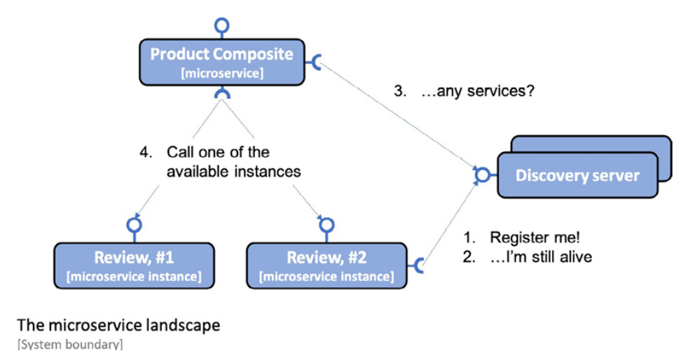
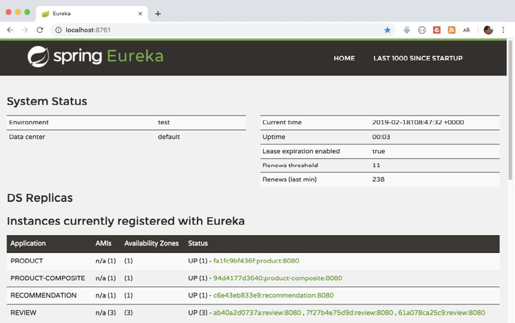
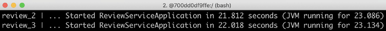
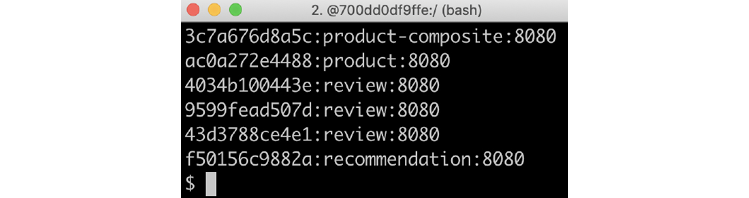
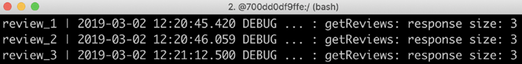
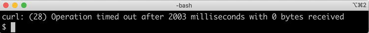
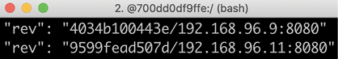

# Adding Service Discovery Using Netflix Eureka

we will use Netflix Eureka as a discovery service for microservices based on Spring Boot.
To allow our microservices to communicate with Netflix Eureka, we will use the Spring Cloud module for Netflix Eureka clients.

## Introduction to service discovery

Service discovery is probably the most important support function required to make a landscape of cooperating microservices production-ready. Netflix Eureka was the first discovery server supported by Spring Cloud.

Netflix Eureka implements client-side service discovery, meaning that the clients run software that talks to the discovery server, Netflix Eureka, to get information about the available microservice instances.



The process is as follows:

1. Whenever a microservice instance starts up – for example, the Review service – it registers itself to one of the Eureka servers.
2. On a regular basis, each microservice instance sends a heartbeat message to the Eureka server, telling it that the microservice instance is okay and is ready to receive requests.
3. Clients – for example, the Product Composite service – use a client library that regularly asks the Eureka service for information about available services.
4. When the client needs to send a request to another microservice, it already has a list of available instances in its client library and can pick one of them without asking the discovery server. Typically, available instances are chosen in a round-robin fashion; that is, they are called one after another before the first one is called once more.

Further ahead, in this POC, we will look at an alternative approach to providing a discovery service using a server-side service concept in Kubernetes.

Spring Cloud comes with an abstraction of how to communicate with a discovery service such as Netflix Eureka and provides an interface called DiscoveryClient. This can be used to interact with a discovery service to get information regarding available services and instances. Implementations of the DiscoveryClient interface are also capable of automatically registering a Spring Boot application with the discovery server.

Spring Boot can find implementations of the DiscoveryClient interface automatically during startup, so we only need to bring in a dependency on the corresponding implementation to connect to a discovery server. In the case of Netflix Eureka, the dependency that's used by our microservices is spring-cloud-starter-netflix-eureka-client.

Spring Cloud also comes with an abstraction – the LoadBalancerClient interface – for clients that want to make requests through a load balancer to registered instances in the discovery service. The standard reactive HTTP client, WebClient, can be configured to use the LoadBalancerClient implementation. By adding the @LoadBalanced annotation to a @Bean declaration that returns a WebClient.Builder object, a LoadBalancerClient implementation will be injected into the Builder instance as an ExchangeFilterFunction.

## Setting up a Netflix Eureka server

1. Create a Spring Boot project using Spring Initializr, as described in Chapter 3, Creating a Set of Cooperating Microservices, in the Using Spring Initializr to generate skeleton code section.
2. Add a dependency to spring-cloud-starter-netflix-eureka-server.
3. Add the @EnableEurekaServer annotation to the application class.
4. Add a Dockerfile, similar to the Dockerfiles that are used for our microservices, with the exception that we export the default Eureka port, 8761, instead of the default port for our microservices, 8080.
5. Add the Eureka server to our three Docker Compose files, that is, docker-compose.yml, docker-compose-partitions.yml, and docker-compose-kafka.yml, like this:

## Connecting microservices to a Netflix Eureka server

To be able to register a microservice instance in the Eureka server, we need to do the following:

1. Add a dependency to spring-cloud-starter-netflix-eureka-client
2. When running tests on a single microservice, we don't want to depend on having the Eureka server up and running. Therefore, we will disable the use of Netflix Eureka in all Spring Boot tests, that is, JUnit tests annotated with @SpringBootTest. This can be done by adding the eureka.client.enabled property and setting it to false in the annotation.

To be able to look up available microservices instances through the Eureka server in the product-composite microservice, we also need to do the following:

1. Add a Spring bean in the main application class, ProductCompositeServiceApplication, that creates a load balancer-aware WebClient-builder
2. The WebClient-builder bean can be used by the integration class, ProductCompositeIntegration, by injecting it into the constructor
3. We can now get rid of our hardcoded configuration of available microservices in application.yml
4. The corresponding code in the integration class, ProductCompositeIntegration, that handled the hardcoded configuration is simplified and replaced by a declaration of the base URLs to the APIs of the core microservices

Now we've seen how to connect microservice instances to a Netflix Eureka server, we can move on and learn how to configure the Eureka server and the microservice instances that connect to it.

## Setting up the configuration for development use

Now, it's time for the trickiest part of setting up Netflix Eureka as a discovery service: setting up a working configuration for both the Eureka server and its clients, our microservice instances.

Netflix Eureka is a highly configurable discovery server that can be set up for a number of different use cases, and it provides robust, resilient, and fault-tolerant runtime characteristics. One downside of this flexibility and robustness is that it has an almost overwhelming number of configuration options. Fortunately, Netflix Eureka comes with good default values for most of the configurable parameters – at least when it comes to using them in a production environment.

When it comes to using Netflix Eureka during development, the default values cause long startup times. For example, it can take a long time for a client to make an initial successful call to a microservices instance that is registered in the Eureka server.

Up to two minutes of wait time can be experienced when using the default configuration values. This wait time is added to the time it takes for the Eureka service and the microservices to start up. The reason for this wait time is that the involved processes need to synchronize registration information with each other. The microservices instances need to register with the Eureka server, and the client needs to gather information from the Eureka server. This communication is mainly based on heartbeats, which happen every 30 seconds by default. A couple of caches are also involved, which slows down the propagation of updates.

We will use a configuration that minimizes this wait time, which is useful during development. For use in production environments, the default values should be used as a starting point!

*We will only use one Netflix Eureka server instance, which is okay in a development environment. In a production environment, you should always use two or more instances to ensure high availability for the Netflix Eureka server.*

Let's start to learn what types of configuration parameters we need to know about.

### Eureka configuration parameters

The configuration parameters for Eureka are divided into three groups:

- Parameters for the Eureka server, prefixed with eureka.server.
- Parameters for Eureka clients, prefixed with eureka.client. This is for clients who want to communicate with a Eureka server.
- Parameters for Eureka instances, prefixed with eureka.instance. This is for the microservices instances that want to register themselves in the Eureka server.

Some of the available parameters are described in the Spring Cloud Netflix documentation: https://docs.spring.io/spring-cloud-netflix/docs/current/reference/html/.

For an extensive list of available parameters, I recommend reading the source code:
- For Eureka server parameters, look at the org.springframework.cloud.netflix.eureka.server.EurekaServerConfigBean class for default values and the com.netflix.eureka.EurekaServerConfig interface for the relevant documentation
- For Eureka client parameters, look at the org.springframework.cloud.netflix.eureka.EurekaClientConfigBean class for the default values and documentation
- For Eureka instance parameters, look at the org.springframework.cloud.netflix.eureka.EurekaInstanceConfigBean class for default values and documentation

- Let's start to learn about configuration parameters for the Eureka server.

### Configuring the Eureka server

See application.yml for the eureka server project.

The first part of the configuration, for a Eureka instance and client, is a standard configuration for a standalone Eureka server. For details, see the Spring Cloud documentation that we referred to previously. The last two parameters used for the Eureka server, waitTimeInMsWhenSyncEmpty and response-cache-update-interval-ms, are used to minimize the startup time.

With the Eureka server configured, we are ready to see how clients to the Eureka server, that is, the microservice instances, can be configured.

### Configuring clients to the Eureka server

See the application.yml for each microservice client.

The eureka.client.serviceUrl.defaultZone parameter is used to find the Eureka server, using the hostname localhost when running without Docker and the hostname eureka when running as containers in Docker. The other parameters are used to minimize the startup time and the time it takes to deregister a microservice instance that is stopped.

Now, we have everything in place that's required to actually try out the discovery service using the Netflix Eureka server together with our microservices.

## Trying out Netflix Eureka as a discovery service

```
mvn clean install
docker-compose build
./z_test-em-all.bash start
```

With the system landscape up and running, we can start by testing how to scale up the number of instances for one of the microservices.

### Scaling up

Run the following commands to try out scaling up a service:

1. Launch two extra review microservice instances:
```
docker-compose up -d --scale review=3
```
With the preceding command, we ask Docker Compose to run three instances of the review service. Since one instance is already running, two new instances will be started up.

2. Once the new instances are up and running, browse to http://localhost:8761/ and expect something like the following:



Verify that you can see three review instances in the Netflix Eureka web UI, as shown in the preceding screenshot.

3. One way of knowing when the new instances are up and running is to run this command:

```
docker-compose logs review | grep Started 
```

Expect output that looks as follows:



4. We can also use a REST API that the Eureka service exposes. To get a list of instance IDs, we can issue a curl command, like this:

```
curl -H "accept:application/json" localhost:8761/eureka/apps -s | jq -r .applications.application[].instance[].instanceId
```

Expect a response that looks similar to the following:



5. If you look into the test script, test-em-all.bash, you will find new tests that verify that we can reach Eureka's REST API and that it reports 4 instances:

```
# Verify access to Eureka and that all four microservices are # registered in Eureka
assertCurl 200 "curl -H "accept:application/json" $HOST:8761/eureka/apps -s"
assertEqual 4 $(echo $RESPONSE | jq ".applications.application | length")
```

6. Now that we have all of the instances up and running, let's try out the client-side load balancer by making some requests and focusing on the address of the review service in the responses, as follows:

```
curl localhost:8080/product-composite/1 -s | jq -r .serviceAddresses.rev
```

Expect responses similar to the following:


Note that the address of the review service changes in each response; the load balancer uses round-robin logic to call the available review instances, one at a time.

7. We can also take a look into the review instance's log records with the following command:

```
docker-compose logs review | grep getReviews
```

You will see output that looks similar to the following:



In the preceding output, we can see how the three review microservice instances, review_1, review_2, and review_3, in turn, have responded to the requests.

We can also try to scale down the instances, which we will do next.

### Scaling down

Let's also see what happens if we lose one instance of the review microservice. Run the following commands:

1. We can simulate one instance stopping unexpectedly by running the following command:

```
docker-compose up -d --scale review=2
```

2. After the shutdown of the review instance, there is a short time period during which calls to the API might fail. This is caused by the time it takes for information regarding the lost instance to propagate to the client, the product-composite service. During this time frame, the client-side load balancer might choose the instance that no longer exists. To prevent this from occurring, resilience mechanisms such as timeouts and retries can be used. In Chapter 13, Improving Resilience Using Resilience4j, we will see how this can be applied. For now, let's specify a timeout on our curl command, using the -m 2 option to specify that we will wait no longer than 2 seconds for a response:

```
curl localhost:8080/product-composite/1 -m 2
```

If a timeout occurs, that is, the client-side load balancer tries to call an instance that no longer exists, the following response is expected from curl:



3. Besides that, we should expect normal responses from the two remaining instances; that is, the serviceAddresses.rev field should contain the addresses of the two instances, as in the following:



In the preceding sample output, we can see that two different container names and IP addresses are reported. This means that the requests have been served by the two remaining microservice instances.

After trying out the scaling down of microservice instances, we can try out something that is a bit more disruptive: stopping the Eureka server and seeing what happens when the discovery server is temporarily unavailable.