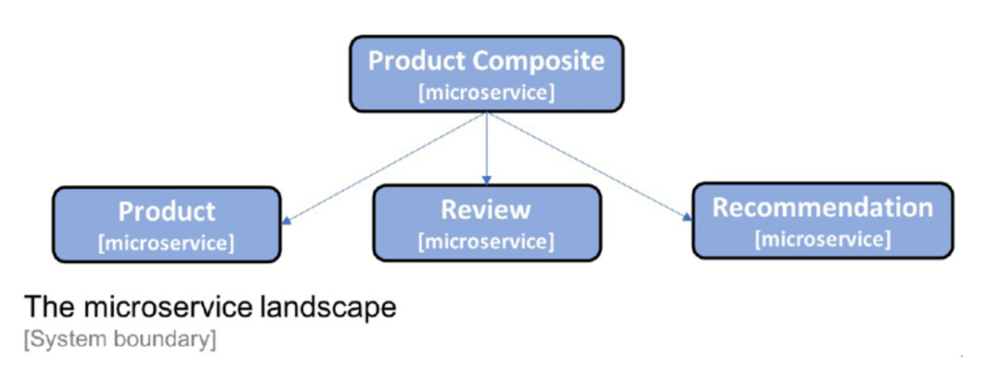

# Creating les microservices

Le but de cette branche est de créer les microservices.

## Microservices



Il se compose de trois microservices principaux, les services Product, Review et Recommendation, qui traitent
tous d'un type de ressource, et d'un microservice composite appelé service Product Composite, qui regroupe les
informations des trois services principaux.

En plus des microservices, nous aurons deux autres projets: ```API``` et ```Utils```. Ils contiendront du code partagé 
par les projets de microservices.

### Composite microservice

L'implémentation du *microservice composite* est divisée en deux partie: un composant d'intégration qui gère les 
requêtes HTTP sortantes vers les services principaux et l'implémentation du service composite elle-même. 

La principale raison de cette répartition des responsabilités est qu'elle simplifie les tests unitaires et 
d'intégration automatisés ; nous pouvons tester l'implémentation du service de manière isolée en remplaçant le 
composant d'intégration par une simulation.

Cette répartition des responsabilités facilitera également l'introduction d'un *circuit breaker*.

L'integration sera fait dans le composant ```ProductCompositeIntegration```, avec RestTemplate pour faire le HTTP 
Requests. Dans le futur, nous introduirons le client HTTP

### API
Nous utiliserons des interfaces Java afin de décrire nos API RESTful et nos classes de modèles pour décrire les 
  données que l'API utilise dans ses requêtes et ses réponses. 
Décrire une API RESTful dans une interface Java plutôt que directement dans la classe Java est un bon 
  moyen de séparer la définition de l'API de son implémentation. Ce projet sera emballé comme une bibliothèque.

*Remarque : il est discutable de savoir s'il est recommandé de stocker les définitions d'API pour un groupe de 
microservices dans un module d'API commun. Cela peut être un bon choix pour les microservices qui font partie de la 
même organisation de livraison, c'est-à-dire dont les versions sont régies par la même organisation (comparez cela 
à un *bound context* dans le DDD, où nos microservices sont placés dans un seul le contexte).*

### Util

Projet qui peut contenir certaines classes d'assistance partagées par nos microservices, par exemple, pour gérer 
les erreurs de manière uniforme. Il sera emballé comme une bibliothèque.

## Informations relatives aux infrastructures

Une fois que nous commencerons à exécuter nos microservices en tant que conteneurs gérés par l'infrastructure 
(d'abord Docker et plus tard Kubernetes), il sera intéressant de savoir quel conteneur a réellement répondu à 
nos demandes. Comme solution simple, un attribut serviceAddress a été ajouté à toutes les réponses, au format 
```hostname/ip-address:port```.

## Remplacement temporaire du *service discovery (SD)*

Étant donné qu'à ce stade, nous n'avons aucun mécanisme du SD en place, nous exécuterons tous les microservices sur 
```localhost``` et utiliserons des numéros de port codés en dur pour chaque microservice. 
Nous utiliserons les ports suivants:

- Service composé de produit : ```7000```
- Service produit : ```7001```
- Service de révision : ```7002```
- Service de recommandation : ```7003```

Nous nous débarrasserons des ports codés en dur plus tard lorsque nous commencerons à utiliser Docker et Kubernetes.

## Run

```z_starts-all.bash```

```z_kill-all.bash```

## *Tests automatisés*

Nous n'avons pas beaucoup de logique métier à tester pour le moment, nous n'avons donc pas besoin d'écrire de tests 
unitaires. Au lieu de cela, nous nous concentrerons sur le test des API que nos microservices exposent; 
c'est-à-dire que nous les lancerons dans des tests d'intégration avec leur serveur Web intégré, puis utiliserons 
un client de test pour effectuer des requêtes HTTP et valider les réponses. 

Avec Spring WebFlux, un client de test, WebTestClient, fournit une API fluide pour faire une requête, puis 
appliquer des assertions sur son résultat.

Pour tester l'API du produit composite (```ProductCompositeIntegration```) de manière isolée, nous devons simuler
(avec Mockito) ses dépendances, c'est-à-dire les 
requêtes adressées aux trois autres microservices qui ont été effectuées par le composant d'intégration.

### Tests API semi-automatisés

En fonctionnement, nous avons également besoin d'un moyen de vérifier automatiquement qu'un système 
de microservices coopérants répond à nos attentes. Pouvoir, à tout moment, exécuter un script qui 
vérifie qu'un certain nombre de microservices coopérants fonctionnent tous comme prévu est très 
précieux - plus il y a de microservices, plus la valeur d'un tel script de vérification est élevée.

Voir le script ```z_test-em-all.bash```